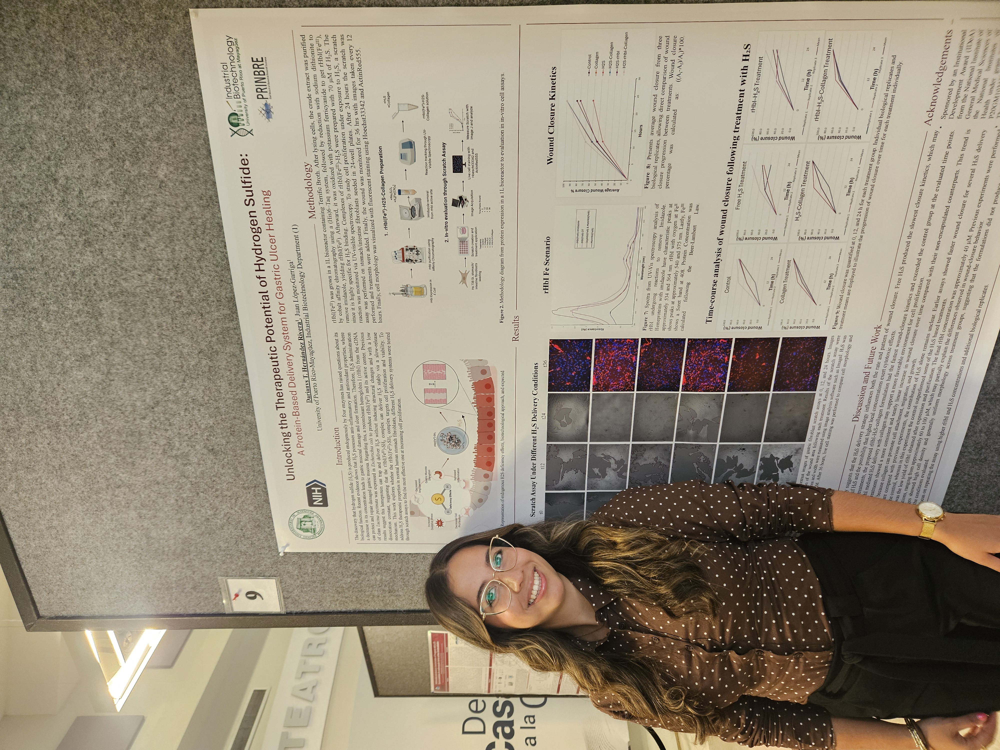

# Greeting:
#### Hi! My name is Darianys Tayrí Hernández Rivera.
<center>

</center>

# A Scientist in the Making:
I am a fourth year undergraduate student in Industrial Biotechnology at the University of Puerto Rico, Mayagüez Campus. My interest revolve around the biomedical field, specifically on how we can genetically modify organisms to produce proteins and other biological products on a large scale for use in medical treatments.
<center>

</center>

# Why Introduction to R for Biologists?
During high school, I was involved in programming, which eventually led me to an internship at Lockheed Martin. Even though I realized that programming was not something I wanted to dedicate my career to, I always remained curious about how I could integrate it into my research and my career in biotechnology.
At the university, I took INGE 3016: Introduction to Programming, where I worked with Python and enjoyed it a lot. Later, through my research internships, I learned that R is commonly used across the scientific community. Therefore, when I saw the opportunity to take this course, I viewed it as a chance to learn something I knew would be valuable for my future research and career. I am excited to see what is ahead!
<center>

</center>

# Class Work
<center>

</center>
<br> 

RT1:<br> 
RT2:<br> 
RT3:<br> 
RT4:<br> 
RT5:
```{r}

```

